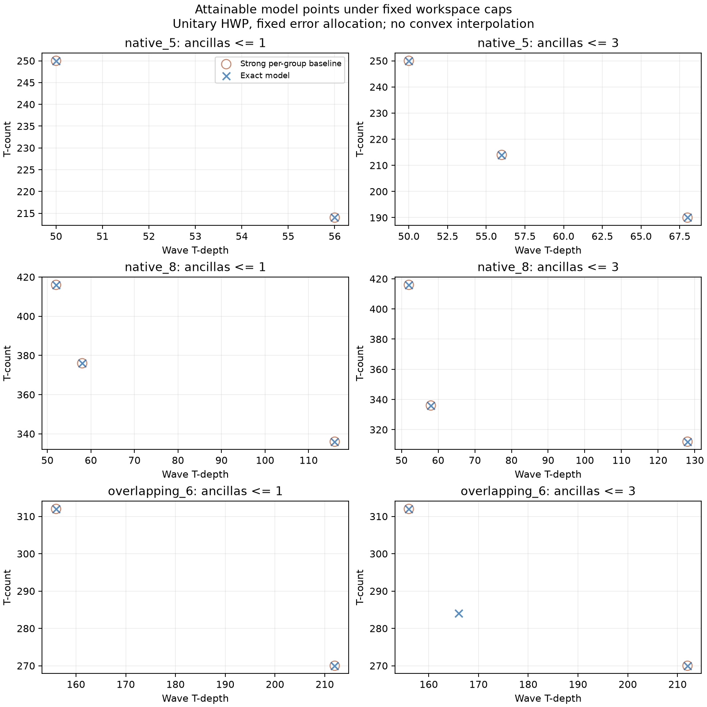

# HWP Pareto Synthesis Study

Development evidence; deterministic unitary Clifford+T only.

Source fingerprint: `c3c3b0d482b0bb474fac66c692028e106f22e755f75049c4d6a7b3c16bcec71b`. Config SHA-256: `17c65715367b79b50f18a47c188df384bcfa8628c884f9411c4b910e938da861`.

Exactness is restricted to all compatible subsets up to the declared batch cap, fixed normalized-term error budgets, and complete-block waves. Every reported circuit was emitted and checked. Measurement-assisted, catalytic, and accumulated-weight HWP are not in this library.

## Construction audit

Direct singleton phases and the existing staged-compressor in-place/copied HWP constructors are reused. Sources: Kivlichan et al., arXiv:1902.10673v4 Appendix A.1; the exact unitary Toffoli template uses Amy et al., arXiv:1206.0758v4. Appendix A.2 accumulation is a different construction requiring recomputation/addition and explicit unitary cleanup; it is deferred, not represented by published measured costs.

## Coverage and cost

| Case | Options / templates | Exact points | New model points | Search s | Baseline s | Library s | Postprocessing s |
|---|---:|---:|---:|---:|---:|---:|---:|
| native_3 | 11 / 5 | 2 | 0 | 0.000 | 0.000 | 0.008 | 0.810 |
| native_4 | 26 / 7 | 2 | 0 | 0.000 | 0.001 | 0.014 | 1.985 |
| native_5 | 57 / 9 | 3 | 0 | 0.013 | 0.009 | 0.026 | 3.021 |
| native_6 | 120 / 11 | 5 | 0 | 0.008 | 0.038 | 0.052 | 4.559 |
| native_8 | 502 / 15 | 7 | 0 | 0.763 | 1.182 | 0.228 | 14.779 |
| heterogeneous_3_2 | 15 / 8 | 2 | 0 | 0.000 | 0.002 | 0.009 | 2.396 |
| overlapping_6 | 67 / 53 | 5 | 1 | 0.001 | 0.008 | 0.083 | 6.479 |
| qedc_mc_004_003_000 | 63 / 46 | 2 | 0 | 0.001 | 0.006 | 0.074 | 4.750 |
| distinct_angles_4 | 4 / 4 | 1 | 0 | 0.000 | 0.004 | 0.002 | 0.386 |

## Constrained comparisons

Baseline = union of direct, best uniform cap, best per-group cap/layout, and existing HWP reference. Uniform/per-group baselines enumerate subset memberships, balanced and full-plus-remainder batches, direct fallback per batch, automatic eligible layouts or fixed layouts, and exact wave schedules. The base reference uses its existing serial batch emission, with the same per-block precision allocation. All parents and verified PyZX children remain available after optimization.

Ancilla caps: `[0, 1, 2, 3, 4, 6, 8]`. Depth caps: `[0, 40, 60, 80, 100, 140, 200, 300, 500]`. Counts below are grid queries, not independent experimental samples. T ties may still differ in depth or workspace.

| Case | Stage | T wins | Newly feasible | T ties | T losses / proposed infeasible | Both infeasible |
|---|---|---:|---:|---:|---:|---:|
| native_3 | model | 0 | 0 | 49 | 0 | 14 |
| native_3 | emitted | 0 | 0 | 49 | 0 | 14 |
| native_3 | post | 0 | 0 | 49 | 0 | 14 |
| native_4 | model | 0 | 0 | 49 | 0 | 14 |
| native_4 | emitted | 0 | 0 | 49 | 0 | 14 |
| native_4 | post | 0 | 0 | 49 | 0 | 14 |
| native_5 | model | 0 | 0 | 49 | 0 | 14 |
| native_5 | emitted | 0 | 0 | 49 | 0 | 14 |
| native_5 | post | 0 | 0 | 49 | 0 | 14 |
| native_6 | model | 0 | 0 | 49 | 0 | 14 |
| native_6 | emitted | 0 | 0 | 49 | 0 | 14 |
| native_6 | post | 0 | 0 | 49 | 0 | 14 |
| native_8 | model | 0 | 0 | 49 | 0 | 14 |
| native_8 | emitted | 0 | 0 | 49 | 0 | 14 |
| native_8 | post | 0 | 0 | 49 | 0 | 14 |
| heterogeneous_3_2 | model | 0 | 0 | 49 | 0 | 14 |
| heterogeneous_3_2 | emitted | 0 | 0 | 49 | 0 | 14 |
| heterogeneous_3_2 | post | 0 | 0 | 49 | 0 | 14 |
| overlapping_6 | model | 1 | 0 | 23 | 0 | 39 |
| overlapping_6 | emitted | 1 | 0 | 23 | 0 | 39 |
| overlapping_6 | post | 1 | 0 | 23 | 0 | 39 |
| qedc_mc_004_003_000 | model | 0 | 0 | 24 | 0 | 39 |
| qedc_mc_004_003_000 | emitted | 0 | 0 | 24 | 0 | 39 |
| qedc_mc_004_003_000 | post | 0 | 0 | 24 | 0 | 39 |
| distinct_angles_4 | model | 0 | 0 | 49 | 0 | 14 |
| distinct_angles_4 | emitted | 0 | 0 | 49 | 0 | 14 |
| distinct_angles_4 | post | 0 | 0 | 49 | 0 | 14 |



## Exact model frontiers

Each tuple is `(T, wave T-depth, clean ancillas)`. Circuit IDs and schedules are in the compact result JSON; full existing-schema circuit/rotation evidence is in the compressed raw artifacts.

### native_3

Status: `OPTIMAL`; baseline enumeration complete: `True`.

`[(108, 54, 1), (150, 50, 0)]`

### native_4

Status: `OPTIMAL`; baseline enumeration complete: `True`.

`[(164, 56, 1), (200, 50, 0)]`

### native_5

Status: `OPTIMAL`; baseline enumeration complete: `True`.

`[(190, 68, 3), (214, 56, 1), (250, 50, 0)]`

### native_6

Status: `OPTIMAL`; baseline enumeration complete: `True`.

`[(204, 74, 4), (228, 56, 2), (228, 112, 1), (270, 56, 1), (312, 52, 0)]`

### native_8

Status: `OPTIMAL`; baseline enumeration complete: `True`.

`[(256, 74, 4), (312, 70, 4), (312, 128, 3), (336, 58, 2), (336, 116, 1), (376, 58, 1), (416, 52, 0)]`

### heterogeneous_3_2

Status: `OPTIMAL`; baseline enumeration complete: `True`.

`[(210, 56, 1), (246, 50, 0)]`

### overlapping_6

Status: `OPTIMAL`; baseline enumeration complete: `True`.

`[(228, 112, 4), (270, 108, 4), (270, 212, 1), (284, 166, 3), (312, 156, 0)]`

### qedc_mc_004_003_000

Status: `OPTIMAL`; baseline enumeration complete: `True`.

`[(228, 112, 4), (312, 156, 0)]`

### distinct_angles_4

Status: `OPTIMAL`; baseline enumeration complete: `True`.

`[(194, 50, 0)]`

## Explanatory witness

Case `overlapping_6`, circuit `p3`: model `(284, 166, 3)`, emitted `(284, 166, 3)`, optimized child `(278, 218, 3)`.

Waves of library option IDs: `((25,), (2,), (23,))`. Full replayable witness: `results/hwp-pareto-witness.json`.

| Wave | Option | Parity masks | Construction | `(T,D,A)` | Scratch wires |
|---:|---:|---|---|---|---|
| 1 | 25 | [1, 2, 4] | in_place_inputs | [114, 56, 1] | [3] |
| 2 | 2 | [3] | direct | [52, 52, 0] | [] |
| 3 | 23 | [5, 6] | copied_parities | [118, 58, 3] | [3, 4, 5] |

The schedule reserves each block for a complete wave; scratch wire IDs repeat only after certified cleanup. The optimized child remains optional if its depth exceeds a query's limit.

At A <= 3 and D <= 200, the best combined reference is `(312, 156, 0)` and this circuit saves 28 T gates. All selected blocks share the same total error policy.

## Interpretation and limits

The exact model contains 1 points not weakly dominated by the combined uniform/per-group references across this fixed study. This is a model-relative observation, not a published-method frontier or held-out result.

An initial diagnostic forced HWP on every baseline batch and reported eight new model points. Allowing direct fallback removes seven of those points; that superseded run is preserved privately under `results/raw/hwp-pareto-study-initial-baseline/`. Those seven are baseline artifacts, not synthesis gains. The final baseline also permits automatic per-batch in-place/copied layout selection.

Model-dominated reconstructions and resource-tied alternatives are discarded before whole-circuit optimization. Consequently, emitted and post-optimization frontiers are candidate frontiers, not exact optima. They can lose to a baseline whose particular reconstruction was retained. Wave barriers may overestimate unconstrained emitted depth.

All data are development cases. Equal-angle native wires reuse compact templates, but subset DP remains exponential; the study measures its behavior through eight terms and does not claim large-instance scalability. Peak RSS in the JSON is the cumulative process peak, not per-case exclusive memory. Synthesis cache state is recorded; first-run and warm-cache timings differ.

The study includes infeasible queries and no-gain cases. No heuristic is inferred from a single witness. Further work should first explain any repeatable gain and check whether it survives a stronger construction library and matched physical assumptions.

## Reproduce

```bash
python scripts/run_hwp_pareto.py --config configs/hwp-pareto-study.yaml --plot
python scripts/run_hwp_pareto.py --config configs/hwp-pareto-study.yaml --verify
```

Plotting requires the optional `study` dependency extra. The tracked summary stores frontier points and query counts; complete grid records and circuits remain in the raw artifact directory.

The runner checkpoints each case. `--resume` checks the config/source fingerprint before reusing checkpoints; output circuits are never treated as feasible without verification in the original run.
